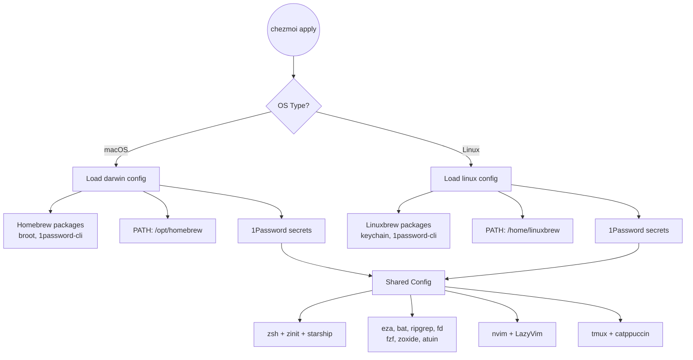

# Dotfiles

Personal dotfiles managed with [chezmoi](https://chezmoi.io/).

## Quick Install (New Machine)

```bash
# One-liner bootstrap
sh -c "$(curl -fsLS get.chezmoi.io)" -- init --apply enzolucchesi

# Or step by step
brew install chezmoi
chezmoi init https://github.com/enzolucchesi/dotfiles.git
chezmoi diff     # Preview changes
chezmoi apply    # Apply changes
```

## Platform Decision Tree



## What's Included

| Category | Tools | Platform |
|----------|-------|----------|
| Shell | zsh, zinit, starship, atuin | Both |
| Terminal | tmux, ghostty | Both |
| Editor | nvim (LazyVim) | Both |
| CLI | eza, bat, ripgrep, fd, fzf, zoxide, delta, television | Both |
| Dev | mise, git, gh | Both |
| Utilities | btop, yazi, broot | Both |
| Secrets | 1Password CLI | Both |

## Repository Structure

```
dotfiles/
├── .chezmoiroot          # Points to home/
├── .chezmoiversion       # Minimum chezmoi version
├── Makefile              # Common operations
├── .mise/tasks/          # mise task runner scripts
├── README.md
└── home/                 # Chezmoi source directory
    ├── .chezmoi.toml.tmpl    # Config template
    ├── .chezmoidata.yaml     # Shared data
    ├── .chezmoiignore        # Ignored files
    ├── .chezmoitemplates/    # Shared template fragments
    │   ├── aliases           # Shell aliases
    │   ├── path-common       # Common PATH setup
    │   └── 1password-secrets # API keys from 1Password
    ├── Brewfile              # Homebrew packages
    ├── dot_zshrc.tmpl        # → ~/.zshrc
    ├── dot_bashrc.tmpl       # → ~/.bashrc
    ├── dot_gitconfig.tmpl    # → ~/.gitconfig
    ├── dot_tmux.conf.tmpl    # → ~/.tmux.conf
    ├── dot_profile.tmpl      # → ~/.profile
    ├── run_once_before_*     # First-run setup scripts
    ├── run_onchange_*        # Package update scripts
    └── dot_config/           # → ~/.config/
        ├── nvim/
        ├── ghostty/
        ├── starship.toml
        └── ...
```

## Daily Commands

```bash
# Using make
make apply      # Apply changes
make diff       # Preview changes
make update     # Pull & apply from git
make status     # Show file status

# Using mise
mise run apply
mise run diff
mise run update

# Direct chezmoi
chezmoi edit ~/.zshrc     # Edit a dotfile
chezmoi re-add            # Re-add modified files
chezmoi cd                # Go to source directory
```

## Secrets Management

API keys are stored in **1Password** and injected at `chezmoi apply` time:

```bash
# Secrets are fetched via chezmoi template functions
# See home/.chezmoitemplates/1password-secrets

# Requires 1Password CLI to be configured:
op account add
op signin
```

## Machine-Specific Config

Edit `~/.config/chezmoi/chezmoi.toml` for machine-specific settings:

```toml
[data]
    name = "Your Name"
    email = "you@example.com"
    github_username = "username"
```

---
*Managed with chezmoi*
